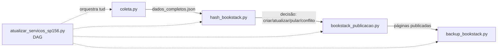

# SP156 → BookStack

Coleta os serviços/informativos do portal SP156 (SMSUB/SELIMP) e publica tudo automaticamente num BookStack, via Airflow.

## Súmarios
[Pré-requisitos](#pré-requisitos)
[Como rodar](#como-rodar)
[O que a DAG faz](#o-que-a-dag-faz)
[Se algo não subir](#se-algo-não-subir)
[Erros mais comuns](#erros-mais-comuns)
[Certificados HTTPS (porta 443)](#certificados-https-porta-443)
[Resetar o ambiente](#resetar-o-ambiente)
[Estrutura](#estrutura)
[Configuração visual do bookstack](css_bookstack.md)
[Guia de Lógica do Código — SP156 → BookStack](#guia-logica)
> [1. coleta.py](#1-coletapy)
> [2. hash_bookstack.py](#2-hash_bookstackpy)
> [3. bookstack_publicacao.py](#3-bookstack_publicacaopy) 
> [4. backup_bookstack.py](#4-backup_bookstackpy) 
> [5. atualizar_servicos_sp156.py — a DAG](#5-atualizar_servicos_sp156py-a-dag)

## Pré-requisitos

Antes de clonar o projeto, o servidor (ou sua máquina) precisa ter:

-  **Docker Engine 24+** e **Docker Compose v2** (`docker compose version`
pra confirmar)

-  **Git**

-  **RAM disponível recomendada: ~8GB.** O `airflow-scheduler` sozinho pode reservar até 4g, e o Chromium headless roda com até 15 workers em paralelo durante a coleta cada aba consome memória.

-  **Portas livres no host:**  `80`, `443` e `8080`. Se algo já estiver usando essas portas, o `docker compose up` vai falhar ao tentar publicá-las.

## Como rodar

**1.** Clone o repositório.

**2.** Copie `.env.example` para `.env` e preencha os valores (veja a seção [Gerando os segredos do `.env`](#gerando-os-segredos-do-env) abaixo).

### Gerando os segredos do `.env`

| Variável | Como gerar / Instrução | Observação Importante |
| :--- | :--- | :--- |
| `AIRFLOW_FERNET_KEY` | `python3 -c "from cryptography.fernet import Fernet; print(Fernet.generate_key().decode())"` | Nenhum desses vem preenchido no repositório — gere um valor único para cada. |
| `AIRFLOW_SECRET_KEY` | `python3 -c "import secrets; print(secrets.token_hex(32))"` | |
| `AIRFLOW_JWT_SECRET` | `python3 -c "import secrets; print(secrets.token_hex(32))"` | **Gere de novo**, não reaproveite o valor acima. |
| `BOOKSTACK_APP_KEY` | `python3 -c "import secrets, base64; print('base64:' + base64.b64encode(secrets.token_bytes(32)).decode())"` | |
| `MYSQL_ROOT_PASSWORD` | `python3 -c "import secrets; print(secrets.token_urlsafe(24))"` | |


  

<span style="color:red">⚠️ **Nunca faça commit do `.env` real.** Ele contém senhas. chaves de verdade. O `.gitignore` já bloqueia isso, mas fique atento se copiar arquivos manualmente entre máquinas. </span>

**3.** Suba tudo com o script de setup.sh ele ajusta a permissão das pastas compartilhadas com o container antes de subir, evitando que o `dag-processor` falhe por não conseguir escrever em `airflow/logs/`:

- 1º:  ajuste o UID do .env -> id -u o valor que aparecer coloque no AIRFLOW_UID=
- 2º: confira como esta a permissão da pasta
	- ls -la setup.sh
	- se aparecer: -rw-r--r-- 1 usuario usuario 826 ... setup.sh
	- corrija: bash: -> chmod +x setup.sh
	- deve ficar assim: -rwxr-xr-x 1 usuario usuario 826 ... setup.sh
- 3º :bash ./setup.sh

<span style="color:red"> (equivalente a rodar `docker compose up -d --build` na mão, só que com
as pastas já preparadas antes) </span> 

**4.** Acesse:

-  **Airflow**: http://localhost:8080 — usuário `admin`, senha gerada automaticamente a cada subida do container. Pra ver a senha:
```bash:
docker exec airflow-webserver_sp156 cat /opt/airflow simple_auth_manager_passwords.json.generated
```

-  **BookStack**: http://localhost — login padrão na primeira vez:

`admin@admin.com` / `password`. **Troque essa senha assim que entrar** (Configurações → Usuários).

**5.** No Airflow, ative e dispare a DAG `atualizar_servicos_sp156`.

**6.** Gere o token de API do BookStack: menu do usuário → **Meu perfil** → **Tokens de API** → **Coloque o nome do token mas não coloque data** criar token novo, e cole `BOOKSTACK_TOKEN_ID` / `BOOKSTACK_TOKEN_SECRET` no `.env`. Depois de adicionar, suba de novo (`docker compose up -d`) pra essas variáveis chegarem ao container.

## O que a DAG faz

**1.**  Ajusta permissões das pastas compartilhadas (dados/backups/logs usados *durante* a execução do pipeline — não confundir com o passo de setup do host acima, que resolve a permissão de `airflow/logs/` antes mesmo do Airflow subir).

**2.** Coleta o menu de serviços (Selenium).

**3.** Varre a faixa de IDs 700–7000 procurando serviços que não aparecem no menu (ver justificativa no início da DAG).

**4.** Extrai o conteúdo completo de cada serviço/informativo, já filtrado por órgão (SMSUB/SP156/SELIMP).

**5.** Publica no BookStack (Estante SP156 → Livro por categoria → Capítulo por grupo → Página por serviço), preservando edições manuais via controle de hash.

**6.** Faz backup do banco do BookStack uma vez por mês.

```
Quer entender a lógica interna de cada etapa (função por função, explicado em linguagem simples)? Veja `GUIA_LOGICA_DO_CODIGO.md` nesse mesmo repositório.
```
## Se algo não subir

Primeiro passo sempre: ver o log do serviço que falhou.
```bash
# log de um serviço específico, em tempo real

docker  compose  logs  -f  airflow-scheduler

# status de todos os containers (procure por "unhealthy" ou "Restarting")

docker  compose  ps
```
## Erros mais comuns 

-  **`dag-processor` reinicia sozinho / DAG não aparece na interface** →

quase sempre é permissão de pasta. Rode `bash setup.sh` de novo (ele reajusta as permissões antes de subir).

-  **Airflow sobe mas fica "unhealthy"** → normalmente é o Postgres

ainda inicializando. Espere ~60s (é o `start_period` do healthcheck) antes de considerar que travou de verdade.

-  **`docker compose up` falha na porta** → algo no host já está usando 80, 443 ou 8080. Libere a porta ou pare o outro serviço.

## Certificados HTTPS (porta 443)

O nginx está configurado para escutar em 80 e 443 (`nginx/conf.d/bookstack.conf`), mas os certificados em `nginx/certs/` não são versionados (ficam de fora do Git por segurança  veja `.gitignore`). Para produção com HTTPS real, gere um certificado (ex: Let's Encrypt) e coloque os arquivos em `nginx/certs/` antes de subir.

## Resetar o ambiente
```bash
docker  compose  down  -v
./setup.sh
```

## Estrutura

```
> setup.sh # prepara permissões e sobe o docker compose
> airflow/dags/ # DAG única do pipeline
> book_cartas_servicos/src/ # código de coleta, publicação, hash e backup 
> dados/ # JSONs gerados em runtime (não versionados)
>nginx/conf.d/ # proxy reverso na frente do BookStack + Airflow
> nginx/certs/ # certificados HTTPS (não versionados, gerar em produção)
> backups/ # dumps mensais do BookStack (não versionados)
> docker-compose.yml
> Dockerfile

GUIA_LOGICA_DO_CODIGO.md > explicação da lógica de cada arquivo, passo a passo
```
[[_TOC_]]

  

## Guia de Lógica do Código — SP156 → BookStack <a id="guia-logica"></a>

Ordem de leitura: **não é a ordem alfabética da pasta**, é a ordem em que o pipeline roda de verdade.


---

## <a id="1-coletapy"></a>1. `coleta.py`

Busca os dados no site do SP156. Não sabe nada sobre BookStack ou banco — só coleta e salva em JSON. 3 etapas, cada uma com checkpoint próprio (retoma de onde parou, não do zero).

| Função | O que faz | Por quê |
| :--- | :--- | :--- |
| **HEADERS** | Finge ser um navegador real. | Sem isso, a proteção anti-bot bloqueia e o pipeline "roda", mas não extrai nada. |
| **orgao_e_da_smsub** | Filtra só SMSUB/SELIMP. | O site lista várias secretarias. |
| **campos_da_pagina** | Extrai O QUE É, PRAZO MÁXIMO, etc. | Lê o texto corrido (não linha a linha) porque o site fragmenta títulos em vários `<span>`. |
| **pegar_menu** *(Etapa 1)* | Navega o menu via Selenium. | Serve como checkpoint por categoria. |
| **pausa_entre_requisicoes** | Pausa aleatória antes de cada request. | Sem isso, workers em paralelo martelam o site e ele bloqueia em massa (caso real: 602/615 bloqueadas). |
| **varrer_ids** *(Etapa 2)* | Testa faixa de IDs 700–7000 em paralelo. | Acha páginas "órfãs" que não aparecem no menu; faz checkpoint por mini-lote de 100. |
| **completar_dados** *(Etapa 3)* | Extrai conteúdo completo + aplica filtro de órgão. | Tem trava de segurança: se >50% das páginas vierem "sem conteúdo", falha de propósito em vez de publicar quase vazio (já aconteceu: 1/615 por causa de captcha). |

**🔗 Próximo:** salva `dados_completos.json` — é o que `bookstack_publicacao.py` lê pra saber o que publicar.

---

## <a id="2-hash_bookstackpy"></a>2. `hash_bookstack.py`

Responde: **"esse conteúdo mudou de verdade desde a última vez?"** Sem isso, toda execução reescreveria tudo, mesmo sem mudança, e apagaria edições manuais feitas direto no BookStack.

-  `hash_de_conteudo` — normaliza o texto (tira espaço duplicado/quebra de linha) e gera um SHA-256. Mesma vírgula a mais → hash igual; conteúdo diferente → hash diferente.

-  `_conectar` — abre conexão nova a cada chamada, porque tasks do Airflow rodam em processos separados (conexão de um processo não serve pro outro).

-  `decidir_acao` (função pura, sem I/O) — devolve uma de 4 ações:

| Ação | Quando |
| :--- | :--- |
| **CRIAR** | Nunca vimos essa página, ou ela "sumiu" do BookStack. |
| **PULAR** | Fonte não mudou e a página ainda existe. |
| **CONFLITO** | Alguém editou a página por fora do robô. |
| **ATUALIZAR** | Fonte mudou e ninguém mexeu manualmente. |

**🔗 Próximo:**  `bookstack_publicacao.py` importa `decidir_acao` — ele não decide sozinho, pergunta pra esse arquivo.

---

## <a id="3-bookstack_publicacaopy"></a>3. `bookstack_publicacao.py`

Fala com a API do BookStack. Hierarquia: `Estante → Livro → Capítulo → Página`.

  -  `_obter_ou_criar` — padrão **get or create**: procura pelo nome, cria só se não achar. Usado pra Estante/Livro/Capítulo.

-  `_pagina_compativel_com_tipo` / `_pagina_compativel_com_codigo` — guarda contra **duas páginas com o mesmo nome** (ex: "Fazer reclamação" se repete em várias categorias). Sem isso, a segunda sobrescreveria o conteúdo da primeira silenciosamente.

-  `_resolucao_de_conflito` — lê tags `sp156_aprovado` / `sp156_rejeitado` que um humano coloca manualmente na página, pra resolver um conflito sem precisar mexer em código.

-  `CONTADOR_POR_STATUS` / `ROTULO_ACAO_EVENTO` — dicionários de "tradução" (status técnico → nome do contador / texto de exibição). Centralizam a tradução num lugar só, em vez de espalhar `if status == ...` em vários pontos do código.

-  `publicar_no_bookstack(arquivo, apenas_um=False)` — função principal chamada pela DAG. `apenas_um=True` processa só a primeira categoria (usado pra testar rápido, não usado em produção). Devolve um dicionário-resumo (`paginas_criadas`, `paginas_atualizadas` etc.) — é isso que aparece no log da task no Airflow.

**🔗 Próximo:** depois de publicar tudo, o pipeline segue pro backup — faz sentido backupar **depois**, pra capturar o conteúdo mais recente.

---

## <a id="4-backup_bookstackpy"></a>4. `backup_bookstack.py`

O mais simples dos quatro: dump do MariaDB → `.gz` → apaga backups antigos. Sem paralelismo, sem checkpoint (roda 1x por mês).

  -  `_rodar_mariadb_dump` — se falhar, apaga o `.sql` parcial (evita backup corrompido disfarçado de válido).

-  `_apagar_backups_antigos` — nome do arquivo tem timestamp, então ordenar por nome já ordena por data. Mantém só os N mais recentes.

**🔗 Próximo:** não alimenta nenhum outro arquivo. Quem decide *quando*

chamar (regra de "1x por mês") é a DAG.

---

## <a id="5-atualizar_servicos_sp156py-a-dag"></a>5. `atualizar_servicos_sp156.py` — a DAG

Não faz trabalho pesado sozinho — importa os 4 arquivos acima e define **ordem** e **regras** de quando cada um roda:

```python

from src.coleta import pegar_menu, varrer_ids, completar_dados

from src.bookstack_publicacao import publicar_no_bookstack

from src.hash_bookstack import garantir_tabela

from src.backup_bookstack import fazer_backup

```
Pontos-chave:

-  **Tasks não trocam dado em memória** — cada uma escreve num JSON em disco (`PASTA_DADOS` / `ARQ_*`), a próxima lê. É assim que `coleta.py` "conversa" com `bookstack_publicacao.py`.

-  `_var_int` — lê uma Airflow Variable (configurável na interface, sem redeploy) como inteiro, com valor padrão.

-  `schedule=None` — não roda sozinha, só quando disparada manualmente.

-  `max_active_runs=1` — impede duas execuções ao mesmo tempo (evitaria varrer o site em duplicidade e causar mais bloqueio).

-  `params={"forcar_varredura_completa": False}` — vira uma caixinha marcável na tela do Airflow, controla `varrer_ids` sem mexer em código.

-  `backup_bookstack_task` — só chama `fazer_backup()` se o mês mudou desde o último backup salvo numa Airflow Variable. É assim que "mensal" é implementado mesmo a DAG rodando várias vezes no mês.

-  `ajustar_permissoes >> tabela >> menu >> extras >> completos >> publicar >> backup` — o `>>` significa **"depende de"**: cada task só começa depois que a anterior termina com sucesso.

**🔗 Fechando o ciclo:**

```
coleta.py → dados_completos.json

→ hash_bookstack.py decide a ação

→ bookstack_publicacao.py publica

→ backup_bookstack.py faz o dump
  
atualizar_servicos_sp156.py amarra os 4 acima numa DAG.

```
---

## Configuração visual do bookstack

```
Ir até configuração -> custumização -> role até o final e cole exatamente este comando style
```
<style>

body,  .page-content,  .book-content,  .chapter-content,  .shelves-list  {

font-family:  "Georgia",  "Times New Roman",  Times,  serif  !important;

color:  #3a3a3a;

background-color:  #EFEFEF;

line-height:  1.6;

}

#content,  .content-wrap  {

background-color:  #EFEFEF  !important;

}

#header,  .header,  header.header,  .top-header  {

background-color:  #D9D9D9  !important;

border-bottom:  1px  solid  #9A9EA2;

}

#header  a,  .header  a,

#header  .logo,  .header  .logo,

#header  .logo  a,  .header  .logo  a,

#header  .header-links  a,  .header  .header-links  a,

#header  .dropdown-container  a,  .header  .dropdown-container  a,

#header  .dropdown-toggle,  .header  .dropdown-toggle  {

color:  #2f3234  !important;

}

#header  a:hover,  .header  a:hover  {

color:  #17181a  !important;

}

#header  .logo  svg,  .header  .logo  svg,

#header  svg,  .header  svg  {

fill:  #2f3234  !important;

}

#header  .logo,  .header  .logo,

#header  .logo  span,  .header  .logo  span,

#header  .logo-image  +  *,

.header  .logo-text  {

color:  #2f3234  !important;

}

#header  .dropdown-container  .text-link,

.header  .dropdown-container  .text-link,

#header  .dropdown-container  button,

.header  .dropdown-container  button  {

color:  #2f3234  !important;

}

#header  input[type="search"],

#header  input[type="text"],

.search-box  input,

.header-search  input  {

background-color:  #C7CACD  !important;

border:  1px  solid  #9A9EA2  !important;

color:  #2f3234  !important;

border-radius:  3px;

}

#header  input[type="search"]::placeholder,

.search-box  input::placeholder  {

color:  #55585b  !important;

}

#header  .search-box  svg,  .header-search  svg,

#header  .search-box  .svg-icon,  .header-search  .svg-icon  {

fill:  #55585b  !important;

}

h1,  h2,  h3,  h4,  h5,  h6,

.page-content  h1,  .page-content  h2,  .page-content  h3,

.book-content  h1,  .book-content  h2,

.chapter-content  h1,  .chapter-content  h2  {

font-family:  "Georgia",  "Times New Roman",  serif  !important;

font-weight:  700;

letter-spacing:  0.5px;

color:  #33404d;

border-bottom:  3px  double  #A9C1D9;

padding-bottom:  6px;

margin-top:  1.4em;

text-transform:  none;

}

.page-display  >  h1,

.book-content  h1.book-title,

h1.header-title,

.content-header  h1  {

text-transform:  uppercase;

font-size:  2.2rem;

letter-spacing:  1px;

color:  #33404d;

border-top:  4px  solid  #A9C1D9;

border-bottom:  4px  solid  #A9C1D9;

padding:  10px  0;

text-align:  center;

}

.page-content  {

max-width:  900px;

margin:  0  auto;

}

.page-content  blockquote  {

border-left:  4px  solid  #A9C1D9;

font-style:  italic;

padding:  8px  16px;

background-color:  #eee4da;

margin:  16px  0;

}

.shelves-list  .grid-card,

.book-grid-item,

.entity-list  .list-item-book,

.entity-list  .list-item-chapter,

.entity-list  .list-item-page  {

background-color:  #fdfaf5  !important;

border:  1px  solid  #e0d6c8  !important;

border-radius:  4px  !important;

box-shadow:  none  !important;

}

.shelves-list  .grid-card:hover,

.book-grid-item:hover  {

box-shadow:  2px  2px  0  #A9C1D9  !important;

transition: box-shadow 0.15s  ease-in-out;

}

.page-content  a,

.book-content  a,

.chapter-content  a,

.shelves-list  a  {

color:  #B96A5E  !important;

text-decoration:  none;

border-bottom:  1px  solid  #B96A5E;

}

.page-content  a:hover,

.book-content  a:hover,

.chapter-content  a:hover,

.shelves-list  a:hover  {

color:  #954E44  !important;

border-bottom:  1px  solid  #954E44;

background-color:  #f2e2dd;

}

.page-content  a:visited  {

color:  #A5827C  !important;

}

.sidebar-page-list,  #sidebar  {

background-color:  #D9D9D9  !important;

border-right:  1px  solid  #9A9EA2;

}

.tri-layout-header-actions,  .action-buttons,  .header-secondary  {

background-color:  #F5F5F5  !important;

}

.sidebar-page-list  a,  #sidebar  a  {

color:  #3a3a3a  !important;

}

.sidebar-page-list  a:hover,  #sidebar  a:hover  {

color:  #B96A5E  !important;

}

.page-content  table  {

border-collapse:  collapse;

width:  100%;

}

.page-content  table  th  {

border-top:  2px  solid  #A9C1D9;

border-bottom:  1px  solid  #A9C1D9;

text-transform:  uppercase;

font-size:  0.85rem;

letter-spacing:  0.5px;

}

.page-content  table  td  {

border-bottom:  1px  solid  #e0d6c8;

}

.page-metadata,  .content-meta  {

font-style:  italic;

color:  #6b6b6b;

font-size:  0.85rem;

border-top:  1px  solid  #e0d6c8;

padding-top:  6px;

}
</style>
