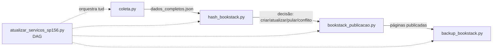

# SP156 → BookStack

Coleta os serviços/informativos do portal SP156 (SMSUB/SELIMP) e publica tudo automaticamente num BookStack, via Airflow.

## Súmarios
- [Pré-requisitos](#pré-requisitos)
- [Como rodar](#como-rodar)
- [Criar perfil de Editor no bookstack](#criar-perfil-de-editor-no-bookstack)
- [Tags para autorizar ou negar a Edição Manual](#tags-para-autorizar-ou-negar-a-edição-manual)
- [O que a DAG faz](#o-que-a-dag-faz)
- [Se algo não subir](#se-algo-não-subir)
- [Erros mais comuns](#erros-mais-comuns)
- [Certificados HTTPS (porta 443)](#certificados-https-porta-443)
- [Resetar o ambiente](#resetar-o-ambiente)
- [Estrutura](#estrutura)
- [Configuração visual do bookstack](css_bookstack.md)
- [Guia de Lógica do Código — SP156 → BookStack](#guia-logica)
	- [1. coleta.py](#1-coletapy)
	- [2. hash_bookstack.py](#2-hash_bookstackpy)
	- [3. bookstack_publicacao.py](#3-bookstack_publicacaopy) 
	- [4. backup_bookstack.py](#4-backup_bookstackpy)
	- [5. atualizar_servicos_sp156.py — a DAG](#5-atualizar_servicos_sp156py-a-dag)

## Pré-requisitos

Antes de clonar o projeto, o servidor (ou sua máquina) precisa ter:

-  **Docker Engine 24+** e **Docker Compose v2** (`docker compose version`
pra confirmar)

-  **Git**

-  **RAM disponível recomendada: ~8GB.** O `airflow-scheduler` reserva até 4g. O Chromium headless é usado pela coleta do menu (Selenium, sequencial) — a varredura antiga que abria muitos Chromium em paralelo foi removida do pipeline (ver [Guia de Lógica](#1-coletapy)).

-  **Portas livres no host:**  `80`, `443` e `8080`. Se algo já estiver usando essas portas, o `docker compose up` vai falhar ao tentar publicá-las.

## Como rodar

**1.** Clone o repositório.

**2.** Copie `.env.example` para `.env` (o `setup.sh` também faz isso sozinho, se você esquecer).

> ℹ️ **Os segredos criptográficos são gerados automaticamente.** `AIRFLOW_FERNET_KEY`, `AIRFLOW_SECRET_KEY`, `AIRFLOW_JWT_SECRET`, `BOOKSTACK_APP_KEY` e `MYSQL_ROOT_PASSWORD` vêm vazios no `.env.example` de propósito — o `setup.sh` preenche cada um sozinho na primeira vez que roda, sem sobrescrever nada que já esteja preenchido. Só revise/troque os valores "legíveis" que já vêm com exemplo (`POSTGRES_USER`, `MYSQL_USER`, `DB_USERNAME`/`DB_PASSWORD`, `AIRFLOW_ADMIN_USER`/`AIRFLOW_ADMIN_PASSWORD`) se quiser algo diferente do padrão.
>
> Precisa **regerar** um segredo já preenchido (ex: ambiente novo do zero)? `bash setup.sh --regerar-segredos` — mas só use isso **antes** do primeiro `docker compose up`; regerar depois que os containers já rodaram (principalmente `MYSQL_ROOT_PASSWORD`) dessincroniza a senha do `.env` da senha real do banco.

<span style="color:red">⚠️ **Nunca faça commit do `.env` real.** Ele contém senhas e chaves de verdade. O `.gitignore` já bloqueia isso, mas fique atento se copiar arquivos manualmente entre máquinas. </span>

**3.** Suba tudo com o script de setup.sh ele ajusta a permissão das pastas compartilhadas com o container antes de subir, evitando que o `dag-processor` falhe por não conseguir escrever em `airflow/logs/`:

- 1º: confira como esta a permissão da pasta
	- ls -la setup.sh
	- se aparecer: -rw-r--r-- 1 usuario usuario 826 ... setup.sh
	- corrija: bash chmod +x setup.sh
	- deve ficar assim: -rwxr-xr-x 1 usuario usuario 826 ... setup.sh
- 2º: bash ./setup.sh

<span style="color:red"> (equivalente a rodar `docker compose up -d --build` na mão, só que com
as pastas já preparadas antes) </span> 

**4.** Acesse:

-  **Airflow**: http://localhost:8080 — usuário `admin`, senha gerada automaticamente a cada subida do container. Pra ver a senha:
```bash
docker exec airflow-webserver_sp156 cat /opt/airflow/simple_auth_manager_passwords.json.generated
```

-  **BookStack**: http://localhost — login padrão na primeira vez:

`admin@admin.com` / `password`. **Troque essa senha assim que entrar** (Configurações → Usuários).

**5.** No Airflow, ative e dispare a DAG `atualizar_servicos_sp156`.

**6.** Gere o token de API do BookStack: menu do usuário → **Meu perfil** → **Tokens de API** → **Coloque o nome do token mas não coloque data** criar token novo, e cole `BOOKSTACK_TOKEN_ID` / `BOOKSTACK_TOKEN_SECRET` no `.env`. Depois de adicionar, suba de novo (`docker compose up -d`) pra essas variáveis chegarem ao container.

## Criar perfil de Editor no bookstack

```
**Entre com o perfil de Admin**

- Configurações -> Perfis -> Selecione: Gerenciar todos os livros, capítulos e permissoes de páginas/ Gerenciar os modelos de página / Exportar conteúdo / Importar conteúdo
- Em Permissões de Ativos selecione tudo
- Vá em Usuários -> Adcionar novo usuário -> Nome e amail -> Marque a caixa de editor -> E desmarque a caixa enviar por email e substituia por senha. 
- Depois só entrar com o perfil de editor

Para deixar o conteúdo publico apenas para vizualização ou exportação: Configurações -> Já na primeira página Acesso Público marque a caixa
```

## Tags para autorizar ou negar a Edição Manual

```
Quando rodar a dag e aparecer conflito no Livro -> Atualização
 - Pegue o código e vá até a pagina -> Clique em editar -> Na lateral direita clique em Editar -> Terá uma barra lateral a sua direita -> Clique no segundo ícone -> Adicionar outro marcador -> preencha o campo "Nome do marcador" com "sp156_rejeitado" (restaura o conteúdo oficial) ou "sp156_aprovado" (mantém a edição manual). Só o nome da tag importa - o campo "Valor do marcador" pode ficar em branco.
```

## O que a DAG faz

**1.**  Ajusta permissões das pastas compartilhadas (dados/logs usados *durante* a execução do pipeline — não confundir com o passo de setup do host acima, que resolve a permissão de `airflow/logs/` antes mesmo do Airflow subir).

**2.** Coleta o menu de serviços (Selenium).

**3.** Abre cada página do menu, uma de cada vez (sequencial, sem paralelismo — evita bloqueio 403 do site), e filtra pelo órgão (SMSUB/SP156/SELIMP).

**4.** Publica no BookStack (Estante SP156 → Livro por categoria → Capítulo por grupo → Página por serviço), preservando edições manuais via controle de hash.

**5.** Faz backup do banco do BookStack (`mariadb-dump`) uma vez por mês — controla isso guardando o mês do último backup numa Airflow Variable, então rodar a DAG várias vezes no mesmo mês não repete o dump à toa.

```
Quer entender a lógica interna de cada etapa (função por função, explicado em linguagem simples)? Veja `GUIA_LOGICA_DO_CODIGO.md` nesse mesmo repositório.
```
## Se algo não subir

Primeiro passo sempre: ver o log do serviço que falhou.
```bash

# log de um serviço específico, em tempo real

docker  compose  logs  -f  airflow-scheduler

# status de todos os containers (procure por "unhealthy" ou "Restarting")

docker  compose  ps
```
## Erros mais comuns 

-  **`dag-processor` reinicia sozinho / DAG não aparece na interface** →

quase sempre é permissão de pasta. Rode `bash setup.sh` de novo (ele reajusta as permissões antes de subir).

-  **Airflow sobe mas fica "unhealthy"** → normalmente é o Postgres

ainda inicializando. Espere ~60s (é o `start_period` do healthcheck) antes de considerar que travou de verdade.

-  **`docker compose up` falha na porta** → algo no host já está usando 80, 443 ou 8080. Libere a porta ou pare o outro serviço.

## Certificados HTTPS (porta 443)

O nginx está configurado para escutar em 80 e 443 (`nginx/conf.d/bookstack.conf`), mas os certificados em `nginx/certs/` não são versionados (ficam de fora do Git por segurança  veja `.gitignore`). Para produção com HTTPS real, gere um certificado (ex: Let's Encrypt) e coloque os arquivos em `nginx/certs/` antes de subir.

## Resetar o ambiente
```bash
docker  compose  down  -v
./setup.sh
```

## Estrutura

```
> setup.sh # prepara permissões e sobe o docker compose
> airflow/dags/ # DAG única do pipeline
> book_cartas_servicos/src/ # código de coleta, publicação, hash e backup
> dados/ # JSONs gerados em runtime (não versionados)
> nginx/conf.d/ # proxy reverso na frente do BookStack + Airflow
> nginx/certs/ # certificados HTTPS (não versionados, gerar em produção)
> backups/ # dumps mensais do BookStack (não versionados)
> docker-compose.yml
> Dockerfile


## Guia de Lógica do Código — SP156 → BookStack <a id="guia-logica"></a>

Ordem de leitura: **não é a ordem alfabética da pasta**, é a ordem em que o pipeline roda de verdade.


---

## <a id="1-coletapy"></a>1. `coleta.py`

Busca os dados no site do SP156. Não sabe nada sobre BookStack ou banco — só coleta e salva em JSON. 3 etapas, cada uma com checkpoint próprio (retoma de onde parou, não do zero).

| Função | O que faz | Por quê |
| :--- | :--- | :--- |
| **HEADERS** | Finge ser um navegador real. | Sem isso, a proteção anti-bot bloqueia e o pipeline "roda", mas não extrai nada. |
| **orgao_e_da_smsub** | Filtra só SMSUB/SELIMP. | O site lista várias secretarias. |
| **campos_da_pagina** | Extrai O QUE É, PRAZO MÁXIMO, etc., preservando link e parágrafo (marcadores invisíveis `MARCADOR_LINK_*`/`MARCADOR_PARAGRAFO`). | Lê o texto corrido (não linha a linha) porque o site fragmenta títulos em vários `<span>`; sem os marcadores, `get_text()` apagava todo `<a>`/`<p>` original. |
| **pegar_menu** *(Etapa 1)* | Navega o menu via Selenium. | Serve como checkpoint por categoria. |
| **pausa_entre_requisicoes** | Pausa aleatória antes de cada request. | Sem isso, workers em paralelo martelam o site e ele bloqueia em massa (caso real: 602/615 bloqueadas). |
| **varrer_ids** *(Etapa 2)* | Testa faixa de IDs 700–7000 em paralelo. | Acha páginas "órfãs" que não aparecem no menu; faz checkpoint por mini-lote de 100. **Não é chamada pela DAG atualmente** — o código continua no arquivo, mas foi removida do pipeline por gerar bloqueio 403 excessivo (ver [O que a DAG faz](#o-que-a-dag-faz)). |
| **completar_dados** *(Etapa 3)* | Extrai conteúdo completo + aplica filtro de órgão, sequencial (sem paralelismo). | Tem trava de segurança: se a maioria das páginas vier "sem conteúdo" ou for tudo bloqueio, falha de propósito em vez de publicar quase vazio (já aconteceu: 1/615 por causa de captcha). |

**🔗 Próximo:** salva `dados_completos.json` — é o que `bookstack_publicacao.py` lê pra saber o que publicar.

---

## <a id="2-hash_bookstackpy"></a>2. `hash_bookstack.py`

Responde: **"esse conteúdo mudou de verdade desde a última vez?"** Sem isso, toda execução reescreveria tudo, mesmo sem mudança, e apagaria edições manuais feitas direto no BookStack.

-  `hash_de_conteudo` — normaliza o texto (tira espaço duplicado/quebra de linha) e gera um SHA-256. Mesma vírgula a mais → hash igual; conteúdo diferente → hash diferente.

-  `_conectar` — abre conexão nova a cada chamada, porque tasks do Airflow rodam em processos separados (conexão de um processo não serve pro outro).

-  `decidir_acao` (função pura, sem I/O) — checa **primeiro** se a página foi editada manualmente no BookStack (independente da fonte ter mudado ou não), e só depois compara com a fonte. Devolve uma de 4 ações:

| Ação | Quando |
| :--- | :--- |
| **CRIAR** | Nunca vimos essa página, ou ela "sumiu" do BookStack. |
| **PULAR** | Fonte não mudou e a página ainda existe, e ninguém editou por fora. |
| **CONFLITO** | Alguém editou a página no BookStack por fora do robô — checado independente da fonte ter mudado. |
| **ATUALIZAR** | Fonte mudou e ninguém mexeu manualmente. |

-  `recalibrar_todas_hash_publicado` — migração pontual (rodar manualmente, uma vez só, nunca como parte da DAG): recalcula o `hash_publicado` de todas as páginas a partir do HTML que o BookStack realmente guarda (via GET), corrigindo o descompasso causado pelo BookStack reprocessar/reformatar o HTML ao salvar.

**🔗 Próximo:**  `bookstack_publicacao.py` importa `decidir_acao` — ele não decide sozinho, pergunta pra esse arquivo.

---

## <a id="3-bookstack_publicacaopy"></a>3. `bookstack_publicacao.py`

Fala com a API do BookStack. Hierarquia: `Estante → Livro → Capítulo → Página`.

  -  `_obter_ou_criar` — padrão **get or create**: procura pelo nome, cria só se não achar. Usado pra Estante/Livro/Capítulo.

-  `_pagina_compativel_com_tipo` / `_pagina_compativel_com_codigo` — guarda contra **duas páginas com o mesmo nome** (ex: "Fazer reclamação" se repete em várias categorias). Sem isso, a segunda sobrescreveria o conteúdo da primeira silenciosamente.

-  `texto_de_campo_para_html` / `_linkificar` — convertem os marcadores de link/parágrafo vindos de `coleta.py` em `<p>` e `<a>` de verdade na página publicada.

-  `criar_atualizar` — cria/atualiza a página via API e **busca ela de volta** (GET) logo em seguida, devolvendo o HTML que o BookStack realmente guardou. É esse HTML (não o que foi enviado) que vira o `hash_publicado` — o BookStack reprocessa o HTML ao salvar, então hashear o que foi enviado nunca batia com uma leitura futura.

-  `_resolucao_de_conflito` — lê tags `sp156_aprovado` / `sp156_rejeitado` que um humano coloca manualmente na página, pra resolver um conflito sem precisar mexer em código.

-  `CONTADOR_POR_STATUS` / `ROTULO_ACAO_EVENTO` — dicionários de "tradução" (status técnico → nome do contador / texto de exibição). Centralizam a tradução num lugar só, em vez de espalhar `if status == ...` em vários pontos do código.

-  `publicar_no_bookstack(arquivo, apenas_um=False)` — função principal chamada pela DAG. `apenas_um=True` processa só a primeira categoria (usado pra testar rápido, não usado em produção). Devolve um dicionário-resumo (`paginas_criadas`, `paginas_atualizadas` etc.) — é isso que aparece no log da task no Airflow.

**🔗 Próximo:** depois de publicar tudo, o pipeline segue pro backup — faz sentido backupar **depois**, pra capturar o conteúdo mais recente.

---

## <a id="4-backup_bookstackpy"></a>4. `backup_bookstack.py`

O mais simples de todos: dump do MariaDB → `.gz` → apaga backups antigos. Sem paralelismo, sem checkpoint (roda 1x por mês).

-  `_rodar_mariadb_dump` — se falhar, apaga o `.sql` parcial (evita backup corrompido disfarçado de válido).

-  `_apagar_backups_antigos` — nome do arquivo tem timestamp, então ordenar por nome já ordena por data. Mantém só os `MANTER_ULTIMOS_PADRAO` (14) mais recentes.

-  `fazer_backup` — junta os dois passos acima e devolve o caminho do arquivo gerado.

**🔗 Próximo:** não alimenta nenhum outro arquivo. Quem decide *quando* chamar (regra de "1x por mês") é a DAG.

---

## <a id="5-atualizar_servicos_sp156py-a-dag"></a>5. `atualizar_servicos_sp156.py` — a DAG

Não faz trabalho pesado sozinho — importa os arquivos acima e define **ordem** e **regras** de quando cada um roda:

```python

from src.coleta import pegar_menu, completar_dados

from src.bookstack_publicacao import publicar_no_bookstack

from src.hash_bookstack import garantir_tabela

from src.backup_bookstack import fazer_backup

```
Pontos-chave:

-  **Tasks não trocam dado em memória** — cada uma escreve num JSON em disco (`PASTA_DADOS` / `ARQ_*`), a próxima lê. É assim que `coleta.py` "conversa" com `bookstack_publicacao.py`.

-  `_var_int` — lê uma Airflow Variable (configurável na interface, sem redeploy) como inteiro, com valor padrão.

-  `schedule=None` — não roda sozinha, só quando disparada manualmente.

-  `max_active_runs=1` — impede duas execuções ao mesmo tempo (evitaria coletar em duplicidade e causar mais bloqueio).

-  `backup_bookstack_task` — só chama `fazer_backup()` se o mês mudou desde o último backup salvo numa Airflow Variable. É assim que "mensal" é implementado mesmo a DAG rodando várias vezes no mês.

-  `ajustar_permissoes >> tabela >> menu >> completos >> publicar >> backup` — o `>>` significa **"depende de"**: cada task só começa depois que a anterior termina com sucesso.

**🔗 Fechando o ciclo:**

```
coleta.py → dados_completos.json

→ hash_bookstack.py decide a ação

→ bookstack_publicacao.py publica

→ backup_bookstack.py faz o dump

atualizar_servicos_sp156.py amarra os arquivos acima numa DAG.

```
---